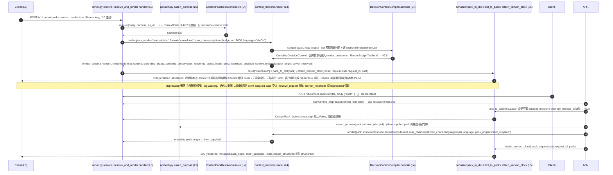

# 渲染时序图：render 并入 resolve（L5/L4/L2 职责切面）

权威代码：`src/tkos_runtime/api/server.py`（resolve 的 render:true 分支 + :render 端点的 deprecated client-supplied 路径）、`src/tkos_runtime/application/context_renderer.py`（`render()`）、`src/tkos_runtime/application/decision_context_compiler.py`（`DecisionContextCompiler`）、`src/tkos_runtime/api/serializer.py`（`pack_to_dict` / `dict_to_pack` / `attach_version_block`）。resolve 链本体见 `sequence-resolve.md`。

## L5 / L4 / L2 职责切面

- **L5（API 传输面）**：resolve handler 判定 `render:true` 分支并把 `rendered` + `structured` + 版本块装配为单一响应；deprecated 的 client-supplied `pack` 路径同样在 L5 被接受、记 warning 并保持可用（迭代 1 删除），且仍需通过 `assert_purpose` 门禁。
- **L4（Context & Reasoning Runtime）**：`render()` → `DecisionContextCompiler.compile` 把结构化 Pack 编译为 sectioned 事实单元，按字符预算两遍分配后组装 Markdown，超预算单元进入 `render_omissions`；渲染只引用 Pack 成员 ID，不产生新事实。
- **L2（Governed Knowledge Graph）**：渲染不触碰图存储——全部事实在 resolve 阶段已物化为 `ContextPack`；`structured` 随附 `rendered` 正是"结构化 Pack 是权威结果、Rendering 不产生新事实"的契约体现。
- **边界**：render 失败经共享映射 `_render_exception_to_http` 转 422/500（`render_budget_too_small` / 其他映射错误 detail），无 rendered 也无 structured 附随；resolve 主路径本身不受影响；LLM 模式只做润色且失败回退 deterministic，语义保留始终 `not_proven`。
