# POST /v1/context-packs:resolve 时序图（L5/L4/L2 职责切面）

权威代码：`src/tkos_runtime/api/server.py`（handler + request_id 中间件）、`src/tkos_runtime/api/auth.py`（authN/authZ）、`src/tkos_runtime/application/scenarios.py`（scenario→purpose）、`src/tkos_runtime/application/context_pack_resolver.py`（resolve 链）、`src/tkos_runtime/domain/policies.py`（AdmissionPolicy）、`src/tkos_runtime/adapters/gram_intent_resolver.py`、`src/tkos_runtime/adapters/rdflib_graph_retriever.py`（L2 读图）、`src/tkos_runtime/application/context_compiler.py`、`src/tkos_runtime/api/serializer.py`（响应装配）。

```mermaid
sequenceDiagram
    autonumber
    participant Client as Client (L5)
    participant MW as server.py _request_id middleware (L5)
    participant API as server.py resolve handler (L5)
    participant Auth as api/auth.py require_token / assert_purpose (L5)
    participant SCN as scenarios.resolve_purpose (L4)
    participant Res as ContextPackResolver.resolve (L4)
    participant Store as RdfDatasetStore.allowed_graphs (L2 读图端口)
    participant Pol as AdmissionPolicy.allowed_graphs (L4)
    participant IR as GramIntentResolver.resolve (L4)
    participant Ret as RdfGraphRetriever.retrieve (L2)
    participant CC as ContextCompiler.compile (L4)
    participant Ser as serializer.pack_to_dict / attach_version_block (L5)

    Client->>MW: POST /v1/context-packs:resolve（Bearer key、可选 X-Request-ID、body 含 query/as_of/scenario）
    MW->>MW: 读取 X-Request-ID 或生成 uuid4().hex[:16]，存入 request.state.request_id
    MW->>API: call_next(request)（响应返回时回显 X-Request-ID 响应头）
    API->>Auth: require_token → Principal{name, allowed_purposes, allowed_scopes, tenant, role, on_behalf_of, confirmer, default_scenario}
    Auth-->>API: Principal（无效 Key → 401）
    Note over API: 旧字段 enterprise_id / organization_scope / purpose / actor_id / persona_id 出现时仅记 deprecated warning（过渡红线，不 422）
    API->>SCN: resolve_purpose(req.scenario, principal.default_scenario)
    SCN-->>API: purpose（未知 scenario → ValueError → 422 unknown_scenario）
    API->>Auth: assert_purpose(purpose, principal)
    Auth-->>API: 通过（purpose 不在 allowed_purposes → 403）
    API->>Res: resolve(query, purpose, as_of, organization_scope, principal.allowed_scopes)
    Res->>Store: allowed_graphs(purpose, principal_scopes)
    Store->>Pol: allowed_graphs(purpose, registered_partition_ids, restricted_partition_ids, principal_scopes)
    Pol-->>Store: 可见命名图清单 = purpose 白名单 ∩ registered 减 restricted 再 ∩ principal_scopes（C3 跨租户窄化）
    Store-->>Res: allowed_graph_ids
    Res->>IR: resolve(query, allowed_graph_ids) → IntentAssessment{root, alternatives, intent_facets}
    IR-->>Res: 命中根对象 / NoMatchError → 404 ontology_context_not_found / AmbiguousMatchError → 409
    Res->>Ret: retrieve(root, allowed_graph_ids)
    Ret->>Ret: BFS ≤ MAX_DEPTH：neighbors / member_statements / subject_statements，按分区保留图身份
    Ret-->>Res: list[RetrievedMember]
    Res->>CC: compile(members, assessment, scope, metadata, as_of, query, purpose)
    CC->>Pol: decide(partition, subject_statements, as_of) 逐分区确认状态 / 有效时间门禁
    CC-->>Res: ContextPack（current / candidate / provenance / derived + omissions / context_gaps / proof）
    Res-->>API: ContextPack
    API->>Ser: pack_to_dict(pack)
    opt render:true（B2 合入）
        API->>API: context_renderer.render(pack, deterministic/markdown)，result["structured"] = pack_dict（见 sequence-render.md）
    end
    Ser->>Ser: attach_version_block(d, request.state.request_id, pack)：api_version/request_id/ontology_release/dataset_revision/policy_version/query_plan_version 六键
    Ser-->>Client: 200 Context Pack + X-Request-ID 响应头回显（401/403/404/409/422 同样回显头）
```

## L5 / L4 / L2 职责切面

- **L5（API 传输面）**：authN（`require_token`）、authZ（`assert_purpose`）、request_id 中间件与响应装配（`pack_to_dict` + `attach_version_block`）全部在本层完成；L5 不承载任何知识筛选、意图解析或推理。
- **L4（Context & Reasoning Runtime）**：`resolve_purpose` 的 scenario→purpose 推导、`GramIntentResolver` 的意图解析、`AdmissionPolicy` 的 purpose/scopes 硬过滤、`ContextCompiler` 的 Context 编译都在本层完成，结构化 `ContextPack` 在本层成型。
- **L2（Governed Knowledge Graph）**：`RdfDatasetStore` / `RdfGraphRetriever` 按保留图身份读取 Current / Candidate / Provenance / Derived 命名图；L2 只回答"可见图内有什么"，不决定"什么可见"——可见性由 L4 的 `AdmissionPolicy` 给出。
- **边界**：L4 经稳定端口（`allowed_graphs` / `resolve` / `retrieve` / `compile`）访问 L2，不经自由形式 SPARQL；错误语义（401/403/404/409/422）由 L5 按契约统一映射，知识不可见即不存在（404 不泄漏存在性）。
