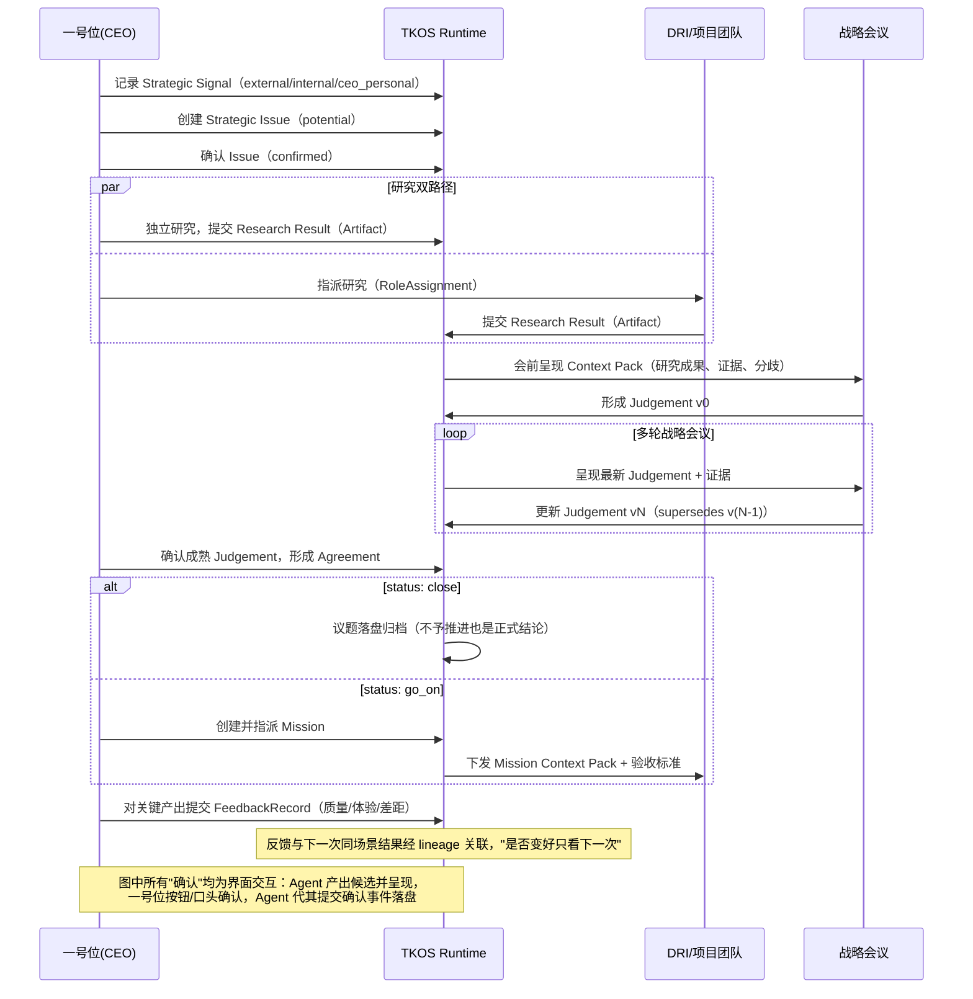

# 核心文档一：统一语言与 MVP 业务闭环

状态：v1（依据 2026-08-13 拍板记录构建）
权威范围：**术语与业务流程的唯一权威**。本体类名（文档二）与 API 字段名（文档三）必须与本文术语一致；三份飞书源文档与本文冲突时，以本文为准并回改源文档。
输入：`业务文档/飞书快照/` 三份源文档 + `docs/architecture/2026-08-13-mvp-requirements-clarification.md` 拍板记录。

---

## 1. MVP 业务闭环（唯一验收流程）

闭环判定标准只有一条：Runtime 支撑一号位 Agent 走完 Signal → Issue → Research → Judgement 版本链 → Agreement → Mission 一次，且每个环节可提交、可确认（界面按钮/口头，经确认事件落盘）、可追溯、可反馈。MVP 验收场景：**产品 1.0 + 灯塔同季交付**。

## 2. 统一术语表（术语 → 本体类 → API 载体）

| 中文 | English | 本体类 | 定义与状态 | API 载体 |
|---|---|---|---|---|
| 战略信号 | Strategic Signal | `tkos:StrategicSignal` | 值得注意的内外部变化线索。来源类型 `signalSourceType: external \| internal \| ceo_personal` | submissions type=`signal` |
| 战略议题 | Strategic Issue | `tkos:StrategicIssue` | 由信号收敛出的待研究问题。状态 `potential →（CEO 确认）→ confirmed` | submissions type=`issue`；resolve 的典型根对象 |
| 战略研究 | Strategic Research | `tkos:StrategicResearch` | 围绕议题的深度研究活动。双路径：CEO 独立研究 ∥ 指派 DRI | — |
| 研究成果 | Research Result | `tkos:Artifact` | 研究产出的材料，经 `producesArtifact` 挂到研究 | submissions type=`research_result` |
| 判断 | Judgement | `tkos:Judgement` | "我认为"。战略会议形成的倾向性结论，**版本不可变**，会议轮次驱动更新，经 `supersedes` 成链 | submissions type=`judgement_version` |
| 共识决议 | Agreement | `tkos:Agreement`（V3.0 新增，⊂ AttributedAssertion） | "我们决定"。CEO 确认成熟 Judgement 后落盘的正式结论。状态 `agreementStatus: close \| go_on`。close（不予推进）同样保留 | submissions type=`agreement` |
| 使命任务 | Mission | `tkos:Mission` | 最小经营运行单元。由 Agreement 的 go_on 授权创建（`mandatedBy`） | submissions type=`mission` |
| 战略会议 | Strategic Meeting | `tkos:DecisionRecord` | 承载会议轮次的决策事件记录。**不新增会议类** | — |
| 证据 | Evidence | `tkos:Evidence` | 支持或挑战判断的事实材料（`supportedByEvidence`） | submissions type=`evidence` |
| 上下文缺口 | Context Gap | `tkos:ContextGap` | 来源无法支持的字段保持为空并显式记录缺口 | submissions type=`context_gap`；Pack 的 `context_gaps` |
| 反馈记录 | Feedback Record | `tkos:FeedbackRecord`（V3.0 新增） | 一号位对关键产出的一次快速评价：质量分 1–5、体验分 1–5、差距说明 | submissions type=`feedback` |
| 上下文包 | Context Pack | `tkos:ContextPack` | API 1 的权威结构化结果；渲染只引用 Pack 成员，不产生新事实 | resolve 响应（`render` 选项附 Markdown） |
| 一号位 | No.1 / CEO | `tkos:Person` + 角色 | 最终决定始终由一号位作出 | Key `role: cxo` |
| 直接责任人 | DRI | `tkos:Person` + `tkos:RoleAssignment` | 承接研究任务或 Mission 的责任人。**Task 不建独立类** | Key `role: executor` |
| 公司宪法 | Company Constitution | 宪法簇 6 类 | 慢变客观事实：为什么存在、什么不可妥协。常驻上下文，不走意图检索 | render “相关原则/决策边界”段 |
| 公司现实 | Company Reality | 现实簇 5 类 | 慢变客观事实：我们是谁、靠什么赢、现状如何 | 锚定检索带出 |
| 产品 | Product | `tkos:Product`（V3.0 新增） | 主数据锚：产品客观描述与版本演进（如产品 1.0） | 锚定检索带出 |
| 工作模式 | Work Pattern | `tkos:WorkPattern` | 四场景工作方法，与场景 Profile 一一绑定 | 场景选择即加载 |
| 候选 / 已确认 | Candidate / Confirmed | 确认状态机制 | 一切写入先为候选，经确认事件进当前有效视图；确认是产品内一等交互（Agent 呈现候选 → 一号位确认） | submissions 唯一写入口（候选写入与确认/拒绝事件）；Pack 区分 `current_facts` 与 `candidate_context` |

## 3. 术语裁定记录（消解三分裂）

1. **Agreement 是唯一的"战略结论落盘"类**。`StrategicChoice`、`StrategicDecision` 及 `selectedAs`、`decidedAs` 于 V3.0 物理删除（时序图只有 Agreement；StrategicChoice 零实例、两属性零使用）。
2. **Strategic Choice 保留为 SICO 方法论阶段用语**（Signal→Issue→Choice→Outcome 的第三环节），不建类——Choice 环节在本体中由 Judgement 版本链 + Agreement 实现。
3. **Task、会议不建类**：任务用 `RoleAssignment` 表达，会议用 `DecisionRecord` 表达。
4. **Decision 不作本体类**：“决策”退回日常用语；战略结论落盘的唯一对象是 `Agreement`（⊂ AttributedAssertion）。`Decision`、`OperatingDecision` 进 V3.0 删除候选，按存留判据审计。
5. Glossary 源文档需补 `Agreement` 词条、移除对 Strategic Decision 的类化暗示；本体方案源文档的战略判断簇改为 `Signal / Issue / Research / Judgement / Agreement`。

## 4. 角色与版本可见性（时序投影，已拍板）

| 角色（API Key 声明） | Judgement 版本链可见性 |
|---|---|
| `cxo` | 全版本 + supersedes 边 + Agreement |
| `executor` | 有 Agreement：仅 Agreement（含被采纳版本摘要）；无 Agreement：仅版本链头（最新版，标注未落盘） |

被裁剪版本一律进 Pack 的 `omissions[stage=temporal_projection]`，保持认知诚实。purpose 与 role 正交：purpose 决定可见分区，role 决定版本链切面。

## 5. 四个使用场景与闭环的关系

| 场景（产品说明，scenario id 为 API 唯一取值） | 在闭环中的位置 | 主要 API 动作 |
|---|---|---|
| 会议督导 `meeting_supervision` | 会前 Pack 呈现 → 会中 → 会后五项产出写回并确认 | resolve(render)（会前）、submissions × 5 + 界面确认（会后）、feedback |
| 战略研究 `strategic_research` | Issue → Research → Research Result | resolve(render)（研究上下文）、submissions（research_result） |
| 专家团讨论 `expert_panel` | Judgement 迭代的输入（分歧、反证） | resolve(render)、submissions（evidence / context_gap） |
| 任务跟进 `task_followup` | Agreement go_on → Mission → 回看 | resolve（Mission Context Pack）、submissions（evidence / feedback） |

会议督导会后五项产出的提交映射：本次确认的决策→`agreement`；战略共识→`judgement_version`；仍需验证的风险→`context_gap`；下一步与责任人→`mission`（草案）；待落盘战略结论→`judgement_version`（候选，待一号位确认）。

## 6. MVP 验收清单（2.0 迭代完成的判定，全部可勾选）

以**产品 1.0 + 灯塔同季交付**议题为载体，在部署环境完成：

1. [ ] 九类提交各成功至少一次（signal / issue / research_result / judgement_version / agreement / mission / evidence / context_gap / feedback），全部先落候选。
2. [ ] 界面确认闭环：inline `confirmed` 与延迟 `type=confirmation` 各走通一次，物化后 resolve 可见，`dataset_revision` 前进且仅该租户前进。
3. [ ] Judgement 版本链 ≥ 2 版，被 supersede 版本 `validUntil` 封口。
4. [ ] Agreement 两种状态各落盘一次（close 与 go_on），go_on 产生 Mission（`mandatedBy` + DRI 指派 + 验收标准）。
5. [ ] 双 Key 投影：同一议题，cxo Key 见全版本链，executor Key 仅见 Agreement / 链头，被裁剪版本进 `omissions[stage=temporal_projection]`；**lineage 同样不可穿透**。
6. [ ] 越权负向测试：executor Key 提交 confirmed 写入 → 403；跨租户 Key 访问 → 404；非法枚举 → 422 附 violation。
7. [ ] lineage 从 Mission 回溯至 Signal 全链可达，边类型正确；feedback 经议题锚可对照下一次产出。
8. [ ] render 段落序符合规范，宪法簇两段恒在（omissions 中无宪法条目），persona 三段降级为 context_gap。
9. [ ] V3.0 迁移交付物齐备：删除清单（逐类豁免核查）、实例迁移映射、前后类数对比、全量回归（解析/SHACL/Openllet/Runtime）绿。
